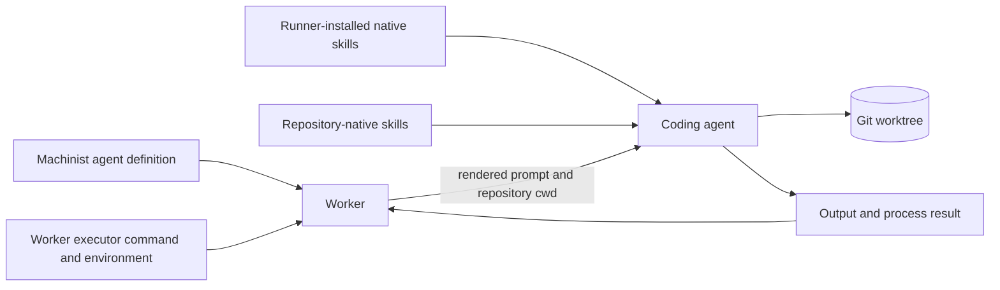

# Runner-managed agent skills

> **Status:** Decided

## 1. Executive summary

Machinist will not implement its own skill discovery, schema, prompt compilation, storage,
or synchronization. Each configured coding agent already has a native skill system. The
runner should install and configure skills using that agent's supported global or project
locations, then let the agent discover and invoke them normally.

This keeps Machinist focused on admission, execution, supervision, and durable run state.
It also preserves the existing boundary: the worker owns the executor command,
environment, credentials, repositories, and therefore the executor's native skills. The
tradeoff is that two workers may behave differently when their installed skills differ.
That is acceptable for the current personal, local machinist. If reproducible multi-runner
provisioning becomes necessary, it should be solved in runner configuration management,
not by adding a second skill runtime to Machinist.

## 2. Context and scope

`config.toml` defines an agent's prompt, logical executor, and timeout. `worker.toml` maps
the logical executor to a local command and runs it in the target Git repository. Codex,
Claude, and other coding harnesses already discover skills from locations they support.

A Machinist-managed skill system would duplicate those native implementations. Machinist
would need to parse metadata, decide scope and precedence, compile or materialize content,
track hashes, add API fields, handle supporting files, and normalize different harness
rules. It would still be unable to stop a harness from discovering project-native skills
from its working directory.

This decision covers where skills belong and what Machinist must not own. It does not
standardize the native skill formats or paths of every executor.

## 3. System context

Machinist resolves and renders the durable agent prompt. The chosen coding harness resolves
its own skills after the worker starts it. Machinist does not read skill files or add skill
content to the rendered prompt.

## 4. Decision

### How skills are supplied

Reusable personal or machine-wide skills live in the coding harness's supported global
skill directory on the runner. Repository-specific skills live in a supported project
skill directory in the target repository. Operators follow the harness's documentation
for exact paths, metadata, supporting files, precedence, and invocation.

For example, Warp documents native project and user skill directories and automatically
discovers the available skill names and descriptions before loading a selected skill.
Codex and Claude should be configured through their own supported mechanisms rather than
through a new Machinist abstraction.

### Machinist responsibilities

Machinist continues to own:

- logical agent and pipeline definitions;
- prompt rendering;
- logical executor and repository selection;
- process supervision, timeout, cancellation, and artifacts;
- managed admission, leasing, persistence, and result delivery.

Machinist does not own:

- skill discovery or invocation;
- skill file parsing or validation;
- shared versus agent-specific skill inheritance;
- copying skills into repositories or temporary directories;
- skill content in agent hashes, SQLite, events, or HTTP responses;
- a skill registry, installer, updater, or compatibility layer.

### Runner responsibilities

The runner operator installs and updates native skills alongside the coding harness. A
skill that should apply across repositories belongs in the harness's user-level scope. A
skill that expresses repository conventions belongs in that repository's supported
project scope.

When different Machinist agents genuinely need isolated skill sets, configure separate
logical executors or native harness profiles if the harness supports them. Machinist may
select those executors by name, but it does not create or manage the profiles.

### Prompt responsibilities

The durable Machinist prompt states the agent's role, safety rules, workflow, and required
outcome. It may tell the coding agent to use an available named skill when the workflow
requires one. It should not paste the skill body or describe native discovery rules that
the harness already supplies.

## 5. Invariants and requirements

### Invariants

- `INV-1`: Machinist never reads, parses, copies, compiles, stores, or serves native skill
  files.
- `INV-2`: Adding or changing a native skill does not change Machinist's agent hash unless
  the configured Machinist prompt, executor, or timeout also changes.
- `INV-3`: Skills do not grant authority. The executor process environment, operating-
  system permissions, repository permissions, and credentials define what an agent can
  do.
- `INV-4`: Direct and managed execution use the same worker-owned native skill setup when
  they run through the same executor on the same runner.
- `INV-5`: Machinist remains compatible with executors that do not support skills.

### Requirements

- Do not add skill fields to `config.toml`, `worker.toml`, the worker protocol, SQLite, or
  the control-plane API.
- Do not scan `~/.machinist`, a worker home directory, or the target repository for skills.
- Do not copy native skill files during `machinist init`.
- Document that native skill availability is part of runner provisioning.
- Keep secrets out of skill files. Supply them through the executor's normal credential
  and environment mechanisms.

## 6. Lifecycle and failure behavior

Machinist does not preflight native skill availability. If a prompt explicitly requires a
missing skill, the coding agent reports the problem or fails according to its native
behavior. Machinist records the resulting output and process state without interpreting it.

Skill changes take effect according to the harness lifecycle. A newly started executor
usually sees the current runner and repository files. Machinist does not snapshot skills
when a managed job is admitted, so a queued job may use a newer native skill version than
the one installed when it was submitted.

Runner provisioning owns recovery. If a runner is rebuilt, its global skills must be
restored with the coding harness. Repository-native skills return with the repository
checkout.

## 7. Security and operations

Runner-installed skills are trusted machine-level agent configuration. Review them like
executor commands and durable prompts, especially when they contain scripts or templates.
Repository-native skills are repository content and must be treated with the same trust
as other task instructions in that checkout.

Native skills can tell an agent to use tools, but they cannot create permissions the
executor process does not have. Machinist must continue to rely on worker credentials,
repository scope, operating-system permissions, and repository protections for real
enforcement.

The operational cost is configuration drift. For the current single-user local machinist,
a documented runner setup is enough. If several workers need identical behavior, manage
the harness and skill directories with dotfiles, a configuration repository, a machine
bootstrap process, or an immutable runner image. Machinist should only gain visibility into
skill versions if a future operational problem proves that external provisioning is not
enough.

## 8. Acceptance criteria

- `AC-1`: No Machinist code, configuration schema, protocol, database, or API change is
  required for skills.
- `AC-2`: A coding agent can discover and use a runner-installed native skill during both
  direct and managed execution.
- `AC-3`: A repository-native skill is available according to the selected harness's
  normal project discovery rules.
- `AC-4`: A runner without a particular skill can still execute agents that do not
  require it.
- `AC-5`: Machinist records missing-skill output and terminal process state without adding
  skill-specific interpretation.
- `AC-6`: The operator documentation names runner provisioning as the source of truth for
  global skill availability.

## 9. Verification approach

No Machinist implementation test is needed because this decision adds no product behavior.
Each runner setup should have a small harness-specific smoke check:

1. install one harmless native skill using the harness's documented location;
2. run the harness directly and confirm it discovers and uses the skill;
3. run the same request through `machinist run`;
4. when using the control plane, submit the same request and confirm the managed worker
   behaves the same way.

These checks verify runner provisioning. They should not become shared Machinist protocol
tests.

## 10. Tradeoffs

- Machinist stays smaller and inherits new native skill features without product changes.
- Skills can use supporting files and invocation behavior that the harness already knows.
- Workers may drift when their installed skills or harness versions differ.
- Machinist cannot show a complete skill inventory or prove which native skill version a
  run used.
- Agent portability depends on using skills supported by the selected executor.
- Project-native instructions may affect the executor independently of the durable Machinist
  prompt. This is already true because the executor runs in the target repository.

The simplicity is worth these costs for the current local machinist.

## 11. Open questions

- Which native skills should be installed on the main runner first? Recommended starting
  set: repository conventions, testing, implementation delivery, and independent review.
- Where should runner setup be versioned? Recommended default: the existing personal
  dotfiles or machine bootstrap repository, not this Machinist runtime repository.

Neither question requires a Machinist feature.

## 12. Out of scope

- A Machinist skill schema or registry.
- Skill synchronization or snapshotting.
- Cross-harness skill translation.
- Skill metadata in run records or the control-plane UI.
- Per-skill secrets, permissions, executors, or repositories.
- Disabling native project instruction or skill discovery.

## References

- [Warp skills for agents](https://docs.warp.dev/agents/capabilities/skills/)
- [Warp machinist definition syntax](https://docs.warp.dev/factories/machinist-as-code/)
- [Warp issue-to-PR example](https://github.com/warpdotdev/warp-machinist-examples/tree/main/examples/02-sdlc-issue-to-pr)
