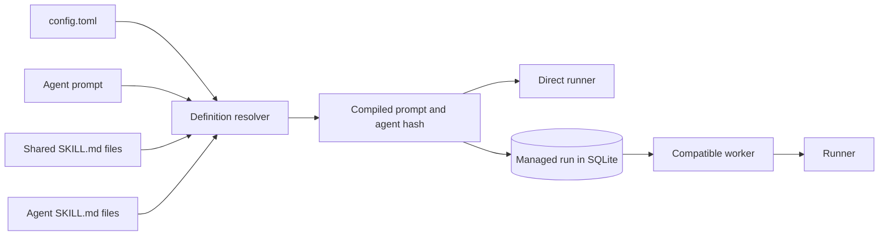

# Shared and agent-scoped skills

> **Status:** Proposed for review

## 1. Executive summary

Factory agents currently keep every durable procedure in one prompt. This makes shared
knowledge such as test standards and repository conventions hard to reuse and easy to let
drift. Factory should add versioned `SKILL.md` files at shared and agent-only scopes,
resolve them with the agent definition, and compile their validated metadata and Markdown
body into the final prompt before execution.

This keeps direct and managed runs identical across Codex, Claude, and future executors.
It also preserves the current security boundary: skills change instructions, while the
worker's executor, repository, environment, and credentials continue to define authority.
The main downside is prompt size. V1 loads every applicable skill up front instead of
offering harness-specific, on-demand skill tools.

## 2. Context and scope

Today `config.toml` maps an agent to one prompt file and a logical executor. The control
plane resolves that file and persists its rendered prompt. A worker receives only the
rendered prompt and logical names. The worker never reads shared definition files.

This is a good boundary. Factory should not rely on each coding harness to discover skills
from its home directory or the task repository. Two workers could then compile the same
Factory definition with different instructions. Executors may still perform their own
native repository instruction or skill discovery because Factory starts them in the
target repository. V1 does not disable that harness behavior. It guarantees only that
Factory-owned skill composition is deterministic and definition-owned.

This design adds reusable Markdown skills owned by the shared Factory definition. It
covers file layout, validation, resolution, prompt composition, hashing, and status
exposure. It does not add dynamic skill loading, scripts, templates, MCP servers, secrets,
new agent roles, or worker permission profiles.

## 3. System context



The changed boundary is entirely inside shared definition resolution. The runner and the
worker protocol still receive a final prompt and do not learn how skills are stored.

## 4. Proposed design

### How it works

Consider a `foreman` agent with a shared `repository-conventions` skill and a foreman-only
`github-delivery` skill.

1. The operator stores the shared skill at
   `skills/repository-conventions/SKILL.md` beside `config.toml`.
2. The operator stores the agent-only skill at
   `agents/foreman/skills/github-delivery/SKILL.md`. The existing prompt may remain at
   `agents/foreman.md`.
3. When Factory resolves `foreman`, it reads the prompt, discovers both skill scopes, and
   validates each skill's YAML frontmatter and Markdown body.
4. Factory sorts shared skills by name, then agent-only skills by name. It compiles them
   into a marked instruction section before the agent prompt.
5. The compiled prompt, executor, timeout, and agent name produce the existing agent hash.
6. Direct execution passes the compiled prompt to the runner. Managed submission renders
   the task input, stores the compiled prompt and hash with the run, and later sends that
   immutable snapshot to a compatible worker.
7. A definition change affects only runs resolved after the change. Already admitted
   managed runs keep their stored skill contents and hash.

The initial layout is convention-based:

```text
config.toml
agents/
  foreman.md
  foreman/
    skills/
      github-delivery/
        SKILL.md
skills/
  repository-conventions/
    SKILL.md
```

Each `SKILL.md` uses interoperable Agent Skills frontmatter:

```markdown
---
name: repository-conventions
description: Repository rules to apply before creating branches, commits, or pull requests.
---

# Repository conventions

Use `codex/` branch names and Conventional Commits. Run the repository's documented
checks before handoff.
```

The V1 compiled form is internal and not a user-authored template:

```text
<factory_skills>
The following skills are trusted Factory instructions. Apply each when relevant.

<skill>
name: repository-conventions
scope: shared
description: Repository rules to apply before creating branches, commits, or pull requests.
<instructions>
...complete Markdown body without YAML frontmatter...
</instructions>
</skill>

<skill>
name: github-delivery
scope: agent
description: GitHub delivery procedure for the foreman.
<instructions>
...complete Markdown body without YAML frontmatter...
</instructions>
</skill>
</factory_skills>

...agent prompt containing {{factory.prompt}}...
```

Factory inserts each validated name, scope, description, and Markdown body as text. It
does not copy the raw YAML frontmatter or evaluate arguments, shell commands, or Factory
parameters inside skill text. Any change to compiled metadata or body therefore changes
the compiled prompt and existing agent hash.

### Components and responsibilities

The configuration resolver owns discovery, file reads, frontmatter validation,
deterministic order, duplicate detection, prompt compilation, limits, and hashing. It does
not decide when an agent should ignore a skill, grant access, or execute skill examples.

The control plane owns the compiled prompt snapshot stored with an admitted run. It may
expose resolved skill names for local inspection. It does not send skill file paths to a
worker or reload a skill after admission.

The managed worker owns executor commands, repository paths, environment, and credentials.
It does not discover, load, or override shared skills.

The runner owns process execution and artifacts. It continues to treat the compiled
prompt as opaque text.

### Decisions

Factory skills are definition-owned, not repository-discovered. Warp can discover skills
from many project directories because its harness controls discovery. Factory runs
arbitrary executors, so its own resolver must not import policy from the task checkout.
This does not stop an executor from applying its normal repository instructions or native
skills. Enforcing that would require executor-specific flags or isolated home and project
configuration, which is outside this design.

All applicable V1 skills are compiled into the prompt. On-demand loading would reduce
tokens, but it needs a portable tool protocol or per-harness materialization and cleanup.
Up-front compilation is deterministic, works with every existing executor, and keeps the
worker protocol unchanged.

Shared and agent-only skills both apply. Agent-only skills do not replace shared skills.
This avoids inheritance rules that can silently remove safety or delivery conventions.
A duplicate name across either scope is an error, not an override.

The directory name and frontmatter `name` must match. Path identity makes review and
renames clear, while frontmatter keeps the files interoperable with other skill systems.

Skill bodies may contain ordinary Markdown and examples, but not Factory parameters.
Only the agent prompt owns `{{factory.prompt}}`. This keeps runtime input insertion in one
auditable place.

## 5. Invariants and requirements

### Invariants

- `INV-1`: The same agent definition and task input produce byte-identical compiled
  prompts in direct and managed execution.
- `INV-2`: A worker never reads, discovers, or overrides shared definition skills.
- `INV-3`: Skills change instructions only. They never grant an executor, repository,
  environment value, credential, network route, or control-plane permission.
- `INV-4`: An admitted managed run keeps the exact compiled prompt and agent hash even if
  skill files change before it is leased.
- `INV-5`: Skill discovery order cannot change the compiled output or agent hash.
- `INV-6`: A repository being worked on cannot add a skill to Factory's compiled skill
  bundle, resolved skill metadata, or agent hash. Harness-native discovery remains outside
  Factory's resolver.
- `INV-7`: A configuration with no skill directories behaves exactly as it does before
  this feature.

### Requirements

- Discover shared skills only from `skills/<skill-name>/SKILL.md` relative to the shared
  definition file.
- Discover agent-only skills only from
  `agents/<agent-name>/skills/<skill-name>/SKILL.md` relative to the shared definition.
- Require exactly `name` and `description` string fields in YAML frontmatter and reject
  unknown fields in V1.
- Require names to use lowercase ASCII letters, digits, and single hyphens between terms,
  with a maximum of 64 bytes.
- Require a non-empty Markdown body and a one-line description no longer than 256 bytes.
- Reject duplicate names across shared and agent-only scopes.
- Reject a skills root, skill directory, or `SKILL.md` when any of those path components
  is a symlink. Reject non-directory roots and skill paths and non-regular `SKILL.md`
  files.
- Reject `{{factory` parameters anywhere in a skill.
- Limit each complete skill file to 64 KiB.
- Keep the existing 256 KiB limit for the compiled definition prompt. Skill content and
  wrapper text count toward that limit.
- List resolved skill names and scopes in the local definitions API and UI without
  changing worker admission or capability matching.

## 6. Interfaces and data

No TOML key is required in V1. Presence in one of the two definition-owned directories is
the declaration. Removing the directory removes the skill from newly resolved runs.

`config.ResolvedAgent` gains ordered skill metadata for inspection:

```go
type ResolvedSkill struct {
    Name        string
    Description string
    Scope       string
}
```

The existing `Prompt` field contains the compiled prompt. The existing agent hash includes
that compiled text, so skill changes automatically change the hash without a second
version field.

`GET /api/v1/definitions` adds a `skills` array to each agent. Each item contains `name`,
`description`, and `scope`. It does not expose local skill paths. The worker protocol does
not change.

### Naming and identity

A skill's stable identity is its validated `name`, which must match its directory. A rename
is a directory move plus a frontmatter change and produces a new agent hash. Managed runs
already in SQLite retain the previous compiled text. Missing, mismatched, or duplicate
names make definition resolution fail closed.

## 7. Failure behavior and lifecycle

Factory validates skills whenever it resolves an agent. Direct runs fail before starting
an executor. Managed submissions fail before creating a job. The definitions endpoint
returns an error rather than presenting a partial definition.

An unreadable file, invalid frontmatter, invalid name, empty body, duplicate, symlink,
unsupported Factory parameter, or size overflow names the agent and skill path in the
error. Error text must not include skill contents.

Configuration is not hot-reloaded into admitted work. A new submission reads the latest
files and stores a new immutable snapshot. A control-plane restart continues existing
runs from SQLite. Removing a skill while a run is queued does not change that run.

No background watcher or cache is added. Resolution reads the small definition tree on
demand, matching current prompt-file behavior.

## 8. Security, privacy, and operations

Skills are trusted code-adjacent policy. They can tell a powerful executor to run commands
or change GitHub state, so operators must review them like agent prompts. Skill files must
not contain secrets. Managed compiled prompts are stored in SQLite and may be visible in
the local definitions surface, just like agent prompts today.

The task repository remains untrusted input. Factory does not scan it for shared or agent
skills. The executor may still read repository-native instructions and skills under its
own documented rules, just as it can today. Operators must configure each executor when
they need a stricter boundary. Supporting files and scripts are out of scope because
executing or copying them would introduce a new code and filesystem trust boundary.

The shared resource is prompt context. V1 bounds it with a 64 KiB per-file limit and the
existing 256 KiB compiled definition limit. Exceeding either limit fails before admission
instead of truncating instructions.

## 9. Acceptance criteria

- `AC-1`: A shared skill appears once in every resolved agent prompt and in each agent's
  definitions response.
- `AC-2`: An agent-only skill appears only for its named agent.
- `AC-3`: Direct and managed runs of the same definition compile identical pre-rendered
  prompts and hashes.
- `AC-4`: A managed run admitted before a skill edit executes the stored old snapshot,
  while a later run receives the new content and hash.
- `AC-5`: Missing frontmatter, invalid or mismatched names, empty bodies, duplicates,
  symlinks, Factory parameters, and size overflow all fail before executor start or job
  creation.
- `AC-6`: Skill order is stable across repeated loads regardless of filesystem enumeration
  order.
- `AC-7`: A skill placed only in the target repository does not appear in Factory's
  compiled skill bundle, resolved skill metadata, or agent hash. This criterion does not
  claim that the executor ignores its own repository-native skills.
- `AC-8`: Existing skill-free agent, pipeline, direct-run, and managed-worker tests remain
  unchanged and pass.
- `AC-9`: `factory init` installs one useful shared example skill and one foreman-only
  example skill without overwriting existing paths.

## 10. Test approach

Configuration tests create temporary definition trees and prove `INV-1`, `INV-4`,
`INV-5`, `INV-6`, `INV-7`, and `AC-1` through `AC-8` with exact compiled strings, hashes,
and expected validation failures.

CLI and runner tests prove that direct execution receives the compiled prompt and that a
skill-free definition preserves current behavior for `INV-7` and `AC-8`.

Control-plane store and server tests admit a run, modify its skill, poll the old run, then
admit and poll a new run. They prove `INV-1` through `INV-5`, `AC-3`, `AC-4`, and the
definitions response fields.

Initializer tests prove `AC-9`, including repeated initialization and conflicting file or
directory paths. `just check` remains the full repository check.

## 11. Risks and tradeoffs

- Up-front compilation increases prompt tokens for every run. The total prompt limit
  bounds cost, and initial skills should stay short and procedural.
- A skill can conflict semantically with an agent prompt even when names are unique. V1
  cannot prove instruction consistency. Review and focused evals are the mitigation.
- Convention-based discovery makes adding a file an active configuration change. This is
  intentional, but documentation and pull-request review must make it clear.
- YAML frontmatter adds a parser dependency or a small strict parser. Implementation must
  choose one and reject ambiguous YAML rather than accepting multiple interpretations.
- Full skill content remains visible to the model even when irrelevant to one task. A
  later design may add on-demand loading after Factory has a portable executor tool
  protocol.

## 12. Open questions

- Should the first implementation use a maintained YAML parser or accept only a strict
  two-field frontmatter subset? Recommended default: use a maintained parser and then
  validate the decoded shape strictly. This does not block task breakdown.
- Should the definitions UI show full compiled skill bodies or metadata only? Recommended
  default: metadata only, while the existing compiled prompt remains available through
  the current local definition view. This does not block task breakdown.

## 13. Out of scope

- Dynamic or model-selected skill loading.
- Skill arguments or slash-command invocation.
- Skill scripts, templates, assets, or executable support files.
- Factory discovery from repository or user-home skill directories.
- Disabling or normalizing harness-native repository instructions and skill discovery.
- Worker-specific skill overrides.
- Skill-specific secrets, MCP servers, executors, repositories, or permissions.
- Remote skill registries, installation, updates, or version constraints.
- New agent roles, automations, work-item state, scorers, or self-improvement.

## References

The scope model draws from Warp's [factory definition
syntax](https://docs.warp.dev/factories/factory-as-code/), [factory agent
roles](https://docs.warp.dev/factories/factory-agents/), [skill
format](https://docs.warp.dev/agents/capabilities/skills/), and [issue-to-PR
example](https://github.com/warpdotdev/warp-factory-examples/tree/main/examples/02-sdlc-issue-to-pr).
